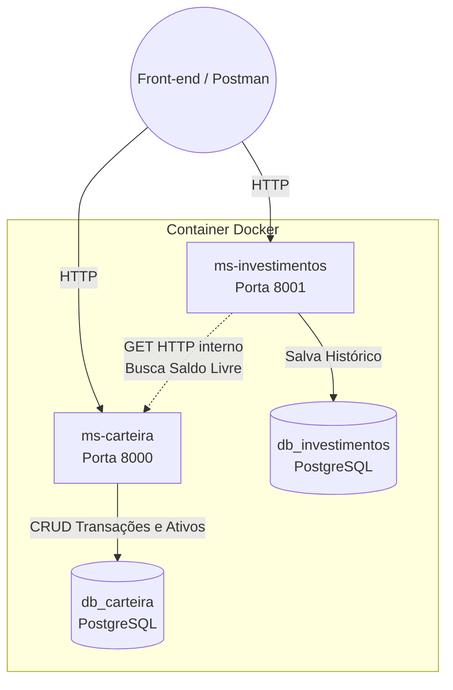

# Carteira Mestre - API de Gestão Financeira e Investimentos

Bem-vindo ao repositório do **Carteira Mestre**, um ecossistema desenvolvido sob a Arquitetura Orientada a Serviços (SOA) focado no controle de fluxo de caixa pessoal, custódia de ativos e projeções matemáticas de investimentos.

---

## Pilares Avaliativos da Disciplina

O projeto foi rigorosamente construído para entregar pontuação máxima, cobrindo os 5 requisitos técnicos fundamentais:

1. **Separação Lógica em MVC (Clean Architecture):** As *Views* (Controllers) do Django não fazem chamadas ao banco de dados. Elas delegam toda a regra de negócios para as classes de `Service`, que por sua vez comunicam-se com os `Repositories` (Padrão de Repositório) para isolar o ORM.
2. **Banco de Dados Duplo :** Usamos o PostgreSQL particionado. O container sobe contendo dois bancos de dados lógicos absolutamente isolados: `db_carteira` e `db_investimentos`. Nenhuma tabela compartilha *Foreign Keys* entre os microserviços.
3. **API RESTful Completa:** O projeto entrega mais do que os 4 endpoints exigidos, com suporte rígido aos verbos HTTP (GET, POST, PUT, DELETE) e retornos precisos via JSON com *Status Codes* (200, 201, 400, 404).
4. **Comunicação entre Serviços (SOA) com Resiliência:** O serviço de simulação consome dinamicamente o saldo do serviço de carteira na rede interna. Como mecanismo de defesa (Fallback), se a carteira falhar, a API intercepta a queda de rede, retorna uma mensagem `400 Bad Request` tratada e aceita processar a simulação através de um preenchimento de valor manual.
5. **Front-end Desacoplado Premium:** A interface foi construída em `HTML/CSS/Vanilla JS` 100% puro (Single Page Application - SPA), sem React ou bibliotecas pesadas. O Front-end interage diretamente com o Docker via requisições assíncronas `fetch()`.

---

## A Divisão dos Microserviços



---

## 🚀 Como Executar o Projeto Localmente

Não há necessidade de instalar Python ou Postgres localmente, apenas o **Docker Desktop**. O projeto aplica o padrão ouro de segurança, isolando senhas e chaves secretas através de variáveis de ambiente.

1. Clone o repositório.
2. **Configure as Variáveis de Ambiente (`.env`):**
   Na raiz do projeto (na mesma pasta do arquivo `docker-compose.yml`), crie um arquivo chamado exatamente `.env` e cole as seguintes credenciais:
   ```env
   # Credenciais do Banco de Dados PostgreSQL
   POSTGRES_USER=postgres
   POSTGRES_PASSWORD=postgres
   POSTGRES_HOST=db
   POSTGRES_PORT=5432

   # Bancos Lógicos Independentes (Microserviços)
   DB_NAME_CARTEIRA=db_carteira
   DB_NAME_INVESTIMENTOS=db_investimentos

   # Chaves de Segurança do Django
   SECRET_KEY=cole_aqui_uma_chave_secreta_segura
   ```
   *(Dica: Para gerar uma chave secreta forte e criptograficamente segura padrão do Django, você pode rodar o comando abaixo no terminal e colar o resultado ali no `.env`):*
   `python -c "from django.core.management.utils import get_random_secret_key; print(get_random_secret_key())"`

   > **Nota de Arquitetura Limpa:** Nenhuma senha ou *Secret Key* foi inserida diretamente (hardcoded) no `settings.py` ou no `docker-compose.yml`. Tudo é lido dinamicamente deste arquivo `.env`.

3. Execute o comando orquestrador para construir e iniciar o ecossistema:
   ```bash
   docker-compose up -d --build
   ```

4. **Aplique as Migrations (Criação das Tabelas):**
   Como a nossa arquitetura usa bancos de dados isolados, você deve rodar a migration para os dois microserviços de forma independente:
   ```bash
   docker-compose exec ms-carteira python manage.py migrate
   docker-compose exec ms-investimentos python manage.py migrate
   ```

5. Para acessar a **Interface Web (Front-end)**, basta abrir o arquivo `frontend-carteira/index.html` no seu navegador Chrome/Edge/Safari.

---

## Endpoints

Utilize a *Postman Collection* incluída neste repositório (`CarteiraMestre_Postman_Collection.json`) para testar todos os verbos e cargas (payloads) instantaneamente.

### ms-carteira (Porta 8000)

**1. Fluxo de Caixa (Transações)**
- `GET /api/transacoes/`: Retorna um objeto complexo contendo o cálculo dinâmico do **Saldo Total** e a lista de entradas/saídas.
- `POST /api/transacoes/`: Cria uma receita ou despesa.
  - JSON Esperado: `{"descricao": "Salário", "tipo": "RECEITA", "valor": 5000.0, "data": "2026-06-25"}`
- `PUT /api/transacoes/{id}/`: Atualiza integralmente uma transação já existente.
  - JSON Esperado: O mesmo do POST, contendo os novos valores atualizados.
- `DELETE /api/transacoes/{id}/`: Remove a transação e recalcula o Saldo Total.

**2. Custódia de Ativos**
- `GET /api/ativos/`: Lista as ações/títulos mantidos na carteira.
- `POST /api/ativos/`: Registra um novo ativo.
  - JSON Esperado: `{"ticker": "PETR4", "quantidade": 100, "preco_medio": 35.50, "data_aquisicao": "2026-06-25"}`
- `PUT /api/ativos/{id}/`: Atualiza a custódia (ex: correção de preço médio de um lote).
- `DELETE /api/ativos/{id}/`: Exclui a ação da sua custódia.

### ms-investimentos (Porta 8001)

**3. Simulador **
- `GET /api/simulacoes/`: Retorna o histórico de todas as projeções feitas.
- `POST /api/simulacoes/`: Endpoint inteligente. Aciona a inteligência SOA para processamento de juros compostos.
  - **Caminho Feliz (Comunicação SOA Ligada):**
    - Envio: `{"meses": 12, "taxa_juros": 0.01, "usar_saldo_carteira": true}`
    - Comportamento: Ignora qualquer valor enviado, puxa o "Saldo Total" dinamicamente da porta 8000 e realiza o cálculo.
  - **Caminho Resiliente (Fallback - Carteira Offline):**
    - Envio: `{"valor_utilizado": 5000, "meses": 12, "taxa_juros": 0.01, "usar_saldo_carteira": false}`
    - Comportamento: Isola a falha da carteira e prossegue o cálculo com o capital injetado manualmente.
- `DELETE /api/simulacoes/{id}/`: Exclui o histórico de uma simulação prévia do banco de dados analítico.

---
*Projeto desenvolvido como Trabalho Final da Disciplina de Web Services / Arquitetura de Software.*
